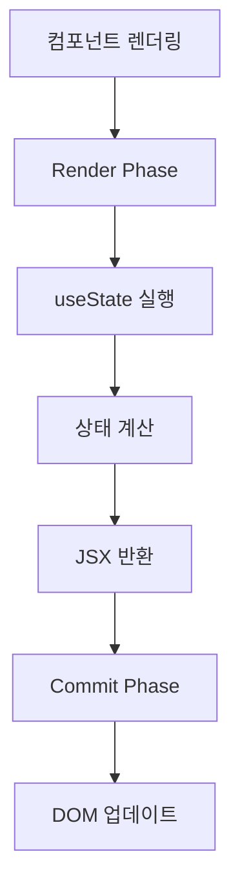
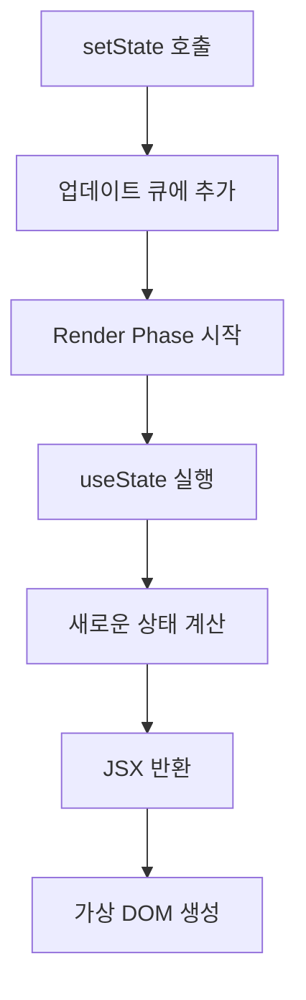
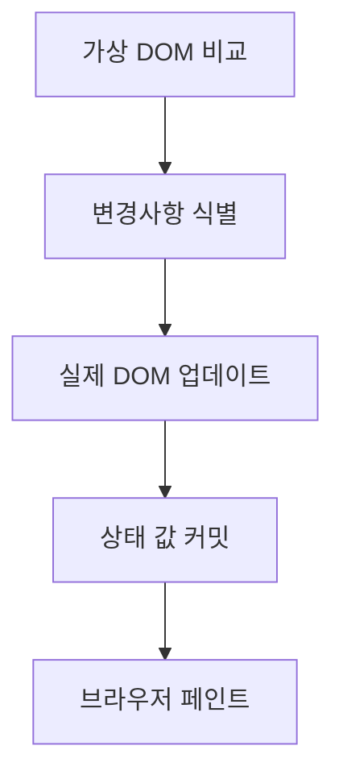

# Week 2: 상호작용성 더하기

## State: 컴포넌트의 기억 저장소

`useState`는 컴포넌트가 렌더링 간에 정보를 **기억**할 수 있게 해주는 Hook입니다.
일반 변수와 달리 `useState`를 사용하면 상태를 변경하고 리렌더링도 되어 사용자에게 반영됩니다.

### useState의 내부 동작 원리

```ts
export type Hook = {
  memoizedState: any; // 현재 상태 값
  baseState: any; // 기본 상태
  baseQueue: Update<any, any> | null;
  queue: any; // 업데이트 큐
  next: Hook | null; // 다음 Hook으로의 참조
};
```

[ReactFiberHooks.js](https://github.com/facebook/react/blob/main/packages/react-reconciler/src/ReactFiberHooks.js)

React는 Hook들을 **연결 리스트(Linked List)** 구조로 관리합니다.

```ts
// 마운트 시 (최초 렌더링)
function mountState<S>(
  initialState: (() => S) | S,
): [S, Dispatch<BasicStateAction<S>>] {
  const hook = mountStateImpl(initialState);
  const queue = hook.queue;
  const dispatch: Dispatch<BasicStateAction<S>> = (dispatchSetState.bind(
    null,
    currentlyRenderingFiber,
    queue,
  ): any);
  queue.dispatch = dispatch;
  return [hook.memoizedState, dispatch];
}

// 업데이트 시 (리렌더링)
function updateState<S>(
  initialState: (() => S) | S,
): [S, Dispatch<BasicStateAction<S>>] {
  return updateReducer(basicStateReducer, initialState);
}
```

[ReactFiberHooks.js](https://github.com/facebook/react/blob/main/packages/react-reconciler/src/ReactFiberHooks.js)

React는 컴포넌트의 생명주기에 따라 함수를 호출합니다.

```ts
const HooksDispatcherOnMount: Dispatcher = {
  useState: mountState,
  useEffect: mountEffect,
  // ... 기타 Hook들
};

const HooksDispatcherOnUpdate: Dispatcher = {
  useState: updateState,
  useEffect: updateEffect,
  // ... 기타 Hook들
};
```

React는 렌더링 단계에 따라 다른 Dispatcher를 사용합니다.

### useState의 렌더링 단계에서의 동작

React의 렌더링 과정에서 `useState`는 Render Phase에서 실행됩니다.



## 렌더링 그리고 커밋

React에서 컴포넌트를 화면에 표시하기 위해서는 렌더링 과정을 거쳐야 합니다. 이 과정을 이해하면 React가 어떻게 동작하는지 더 깊이 알 수 있습니다.

### 1단계: 렌더링 트리거

컴포넌트 렌더링이 일어나는 두 가지 경우:

1. 초기 렌더링
2. State 업데이트 시 리렌더링 - 컴포넌트가 처음 렌더링된 후, `setState`를 통해 상태를 업데이트하면 추가 렌더링이 트리거됩니다.

### 2단계: React 컴포넌트 렌더링

렌더링을 트리거한 후 React는 컴포넌트를 호출하여 화면에 표시할 내용을 파악합니다.

**"렌더링"은 React에서 컴포넌트를 호출하는 것입니다.**

- **초기 렌더링**: React는 루트 컴포넌트를 호출합니다.
- **리렌더링**: React는 이전 렌더링 이후 변경된 속성을 계산합니다.

### 3단계: React가 DOM에 변경사항을 커밋

컴포넌트를 렌더링(호출)한 후 React는 DOM을 수정합니다.

- **초기 렌더링**: `appendChild()` DOM API를 사용하여 생성한 모든 DOM 노드를 화면에 표시
- **리렌더링**: 필요한 최소한의 작업만 적용하여 DOM이 최신 렌더링 출력과 일치하도록 함

**React는 렌더링 간에 차이가 있는 경우에만 DOM 노드를 변경합니다.**

### useState와 렌더링 단계의 연결

`useState`는 Render Phase와 Commit Phase에서 다음과 같이 동작합니다:

#### Render Phase에서의 useState



#### Commit Phase에서의 useState


