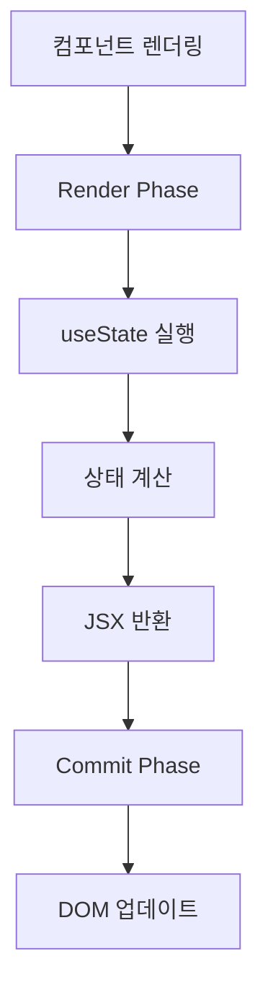

# Week 2: 상호작용성 더하기

## State: 컴포넌트의 기억 저장소

`useState`는 컴포넌트가 렌더링 간에 정보를 **기억**할 수 있게 해주는 Hook입니다.
일반 변수와 달리 `useState`를 사용하면 상태를 변경하고 리렌더링도 되어 사용자에게 반영됩니다.

### useState의 내부 동작 원리

```ts
export type Hook = {
  memoizedState: any; // 현재 상태 값
  baseState: any; // 기본 상태
  baseQueue: Update<any, any> | null;
  queue: any; // 업데이트 큐
  next: Hook | null; // 다음 Hook으로의 참조
};
```

[ReactFiberHooks.js](https://github.com/facebook/react/blob/main/packages/react-reconciler/src/ReactFiberHooks.js)

React는 Hook들을 **연결 리스트(Linked List)** 구조로 관리합니다.

```ts
// 마운트 시 (최초 렌더링)
function mountState<S>(
  initialState: (() => S) | S,
): [S, Dispatch<BasicStateAction<S>>] {
  const hook = mountStateImpl(initialState);
  const queue = hook.queue;
  const dispatch: Dispatch<BasicStateAction<S>> = (dispatchSetState.bind(
    null,
    currentlyRenderingFiber,
    queue,
  ): any);
  queue.dispatch = dispatch;
  return [hook.memoizedState, dispatch];
}

// 업데이트 시 (리렌더링)
function updateState<S>(
  initialState: (() => S) | S,
): [S, Dispatch<BasicStateAction<S>>] {
  return updateReducer(basicStateReducer, initialState);
}
```

[ReactFiberHooks.js](https://github.com/facebook/react/blob/main/packages/react-reconciler/src/ReactFiberHooks.js)

React는 컴포넌트의 생명주기에 따라 함수를 호출합니다.

```ts
const HooksDispatcherOnMount: Dispatcher = {
  useState: mountState,
  useEffect: mountEffect,
  // ... 기타 Hook들
};

const HooksDispatcherOnUpdate: Dispatcher = {
  useState: updateState,
  useEffect: updateEffect,
  // ... 기타 Hook들
};
```

React는 렌더링 단계에 따라 다른 Dispatcher를 사용합니다.

### useState의 렌더링 단계에서의 동작

React의 렌더링 과정에서 `useState`는 Render Phase에서 실행됩니다.


