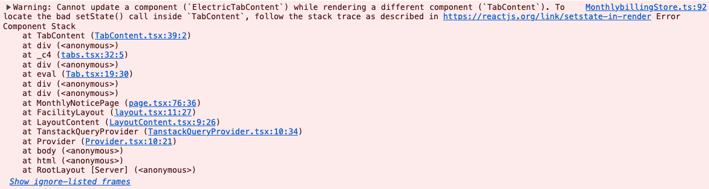

### React에서 강조하는 핵심

---

1. 순수성 : 컴포넌트와 훅은 **오직 계산만 수행**해야 한다.
2. 멱등성 : 같은 입력(Props, State, Context)에 대해 항상 같은 출력을 보장해야 한다.
3. 렌더링 중에는 사이드 이펙트를 실행하지 않고, 이벤트 핸들러나 Effects로 격리해야 한다.
   - 일반적으로 이벤트 핸들러를 통해 트리거 시점을 제어할 수 있도록 구현하고, 불가피한 경우 Effects를 사용하는 것을 권장하고 있다.
4. 불변성 : 인수와 반환값은 모두 불변으로 취급한다.
5. 지역 변경(Local Mutation)은 허용하고 있다.
   - 오히려 성능 최적화에 유용하다고 이를 권장하고 있다.
   - 지역 변경은 리액트의 리렌더링이 발생할 때마다 같이 초기화되어서 사이드 이펙트를 유발하지 않기 때문이라고 한다.
6. 결국 리액트에서 강조하는 핵심과 규칙을 준수해야 하는 이유는 리액트의 자체적인 최적화 로직에 부하를 일으킬만한 행위를 하지 않기 위함이라는 생각이 든다. ~~코딩은 부채다.~~

### Hooks를 조건부로 호출하면 안되는 이유

---

TODO

### State 또는 Props를 직접 변경하는 것과 Setter를 사용해 변경하는 것의 리액트 내부 동작 차이

---

전달받은 Props나 선언한 State를 직접 참조해 변경해도 값은 변하지만, 렌더링은 트리거되지 않는다는 것은 알고 있다. 리액트의 Setter는 내부에서 어떻게 동작하고, 왜 직접 값을 변경하면 안되는 걸까?

[react-reconciler/src/ReactFiberHooks.js](https://github.com/facebook/react/blob/main/packages/react-reconciler/src/ReactFiberHooks.js)

```tsx
react/packages/react-reconciler/src/ReactFiberHooks.js

const currentState: S = (queue.lastRenderedState: any);
const eagerState = lastRenderedReducer(currentState, action);
// Stash the eagerly computed state, and the reducer used to compute
// it, on the update object. If the reducer hasn't changed by the
// time we enter the render phase, then the eager state can be used
// without calling the reducer again.
update.hasEagerState = true;
update.eagerState = eagerState;

if (is(eagerState, currentState)) {
  // Fast path. We can bail out without scheduling React to re-render.
  // It's still possible that we'll need to rebase this update later,
  // if the component re-renders for a different reason and by that
  // time the reducer has changed.
  // TODO: Do we still need to entangle transitions in this case?
  enqueueConcurrentHookUpdateAndEagerlyBailout(fiber, queue, update);
  return false;
}
```

컴포넌트의 렌더링 발생 시 React Fiber에 의해 업데이트 객체가 큐에 추가되어 스케줄링이 이루어지게 된다. 이 과정에서 참조 동등성(`Object.is()`) 기반의 최적화가 이루어지는데, 현재의 상태와 가장 최근에 렌더링됐었던 상태를 업데이트 큐에서 가져와 동일한 참조를 갖는다면, 리액트는 해당 State가 변경된 부분이 없다고 판단하고 Early Return을 수행해버린다.

Setter 함수가 호출될 경우 기존과 다른 참조를 갖는 새로운 객체가 만들어지지만, State 또는 Props를 직접 값을 변경하게 되면 이들은 동일한 참조를 갖는다. 따라서 렌더 스케줄링에서 제외되고, 화면이 업데이트되지 않는 것이다. 이는 리액트에서 강조하고 있는 ‘인수와 반환값의 불변성 유지’를 깨뜨리게 되고, 핵심 최적화 메커니즘을 완전히 무력시키게 되는 행위이기 때문에 지양해야 한다는 것을 알 수 있었다.

<br />

```tsx
react/packages/react-reconciler/src/ReactFiberHooks.js

function mountState<S>(
  initialState: (() => S) | S,
): [S, Dispatch<BasicStateAction<S>>] {
  const hook = mountStateImpl(initialState);
  const queue = hook.queue;
  const dispatch: Dispatch<BasicStateAction<S>> = (dispatchSetState.bind(
    null,
    currentlyRenderingFiber,
    queue,
  ): any);
  queue.dispatch = dispatch;
  return [hook.memoizedState, dispatch];
}

function updateState<S>(
  initialState: (() => S) | S,
): [S, Dispatch<BasicStateAction<S>>] {
  return updateReducer(basicStateReducer, initialState);
}

function rerenderState<S>(
  initialState: (() => S) | S,
): [S, Dispatch<BasicStateAction<S>>] {
  return rerenderReducer(basicStateReducer, initialState);
}
```

재밌는 점은 최초 마운트냐, 리렌더링이냐에 따라 함수를 다르게 호출하여 처리하고 있다는 것이다.Current Fiber 또는 Fiber의 memoizedState가 존재하는 경우 UpdateDispatcher를, 존재하지 않는 경우 MountDispatcher를 분기하여 호출하고 있다. 내부 구현이 useReducer로 구현되어 있는 부분도 흥미로운 것 같다.

### React의 렌더링 과정은 어떻게 이루어지길래 이런 규칙들을 준수해야 하는가?

---

TODO

### React의 자동 렌더링 최적화?

---

TODO

### React 동시성 기능(Concurrent Features)과 시분할 렌더링(Time Slicing)

---

TODO

### React Fiber, Diffing Algorithm

---

TODO

### Case Study



In Progess..
